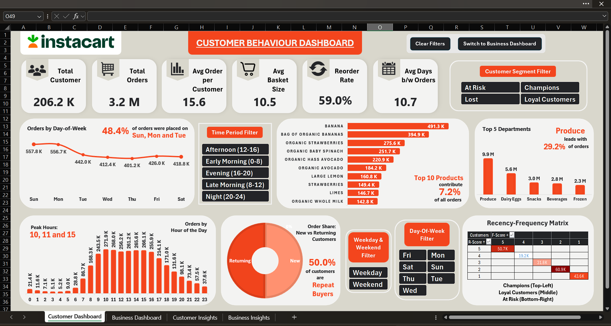
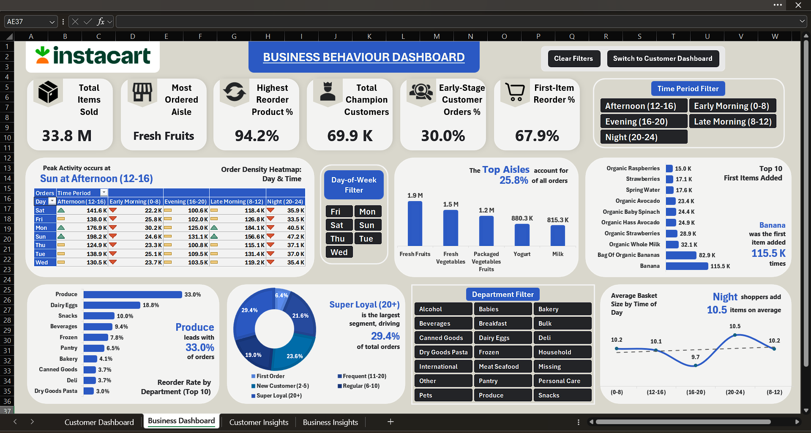

# 🛒 Instacart Customer & Business Analysis (Excel Project)

This Excel-based data analysis project explores customer purchase patterns and behaviour using 3 Million+ transactions from the **Instacart Online Grocery Basket Analysis** dataset.  
The goal is to draw actionable insights about customer activity, product trends, and order timing through interactive dashboards and Excel automation.

---

## 🎯 Project Overview

The project replicates a real-world data analytics workflow inside Excel — from **data cleaning** to **interactive reporting**.

### Key Features
- **Power Query:** Data cleaning, transformation, and merging multiple CSV files.
- **Pivot Tables & Charts:** Dynamic summarization of order trends, departments, and top products.
- **Power Pivot (DAX) Measures:** Used for calculated KPIs like reorder rate, basket size, and customer frequency scoring (RFM).
- **Macros (VBA):**  
  - Clear all filters  
  - Switch between dashboards  
- **Conditional Formatting:** Visual highlights for customer segments and performance metrics.
- **Interactive Filters:**  
  - Day of week  
  - Time period  
  - Weekday/weekend  
  - Customer segments (At Risk, Loyal, Champions, etc.)

---

## 🧩 Dataset Source

**Dataset:** [Instacart Online Grocery Basket Analysis (Kaggle)](https://www.kaggle.com/datasets/yasserh/instacart-online-grocery-basket-analysis-dataset?select=aisles.csv)

The dataset contains information about customer orders, products, aisles, and departments across millions of transactions.  
It helps analyze **when** people order, **what** they buy, and **how frequently** they return.

---

## 🎥 Dashboard Demo

Here’s a short preview of how the dashboards function — applying filters, switching dashboards, and clearing selections.

---

## 📊 Dashboard Previews

### **1. Customer Behaviour Dashboard**
Insights on ordering patterns, basket size, and customer segments.

---

### **2. Business Insights Dashboard**
Overview of department-level sales, top products, and customer retention.

---

## 📦 Download the Excel Dashboard

You can download the full Excel workbook (with Power Query, Pivot Tables, DAX measures, and VBA macros) from the official release below:

[➡️ **Download Instacart_Dashboard.xlsm (Release v1.0)**](https://github.com/rohittydvv/Instacart-Dashboard-Excel/releases/tag/v1.0)

### ⚙️ How to Use

1. Download `Instacart_Dashboard.xlsm` from the link above.  
2. **Unblock the file:**
   - Right-click on the file → **Properties**
   - Check **Unblock** (bottom of the General tab) → **Apply → OK**
3. Open the file in **Microsoft Excel (desktop version)**.  
4. Click **Enable Macros** and **Enable Content** when prompted.  
5. Use the buttons to **switch dashboards** or **clear filters**, and slicers to explore data interactively.

### ⚠️ Notes
- Macros must be enabled for buttons to work.  
- If slicers or macros don’t respond, make sure the file was **unblocked** before opening.  
- Works best on **Excel 2016 or newer (Windows)**.

---

## 🧠 Insights Highlighted

- **Peak order hours:** 10 AM, 11 AM, and 3 PM  
- **Top departments:** Produce, Dairy, Snacks  
- **Repeat customers:** ~50% of total  
- **Reorder rate:** 59%  
- **Top products:** Bananas, Strawberries, Avocados, Spinach  
- **Segment analysis:** Identifies Champions, Loyal, and At-Risk customers.

---

## 🛠️ Tools Used

- **Microsoft Excel** (Power Query, Pivot Tables, Charts, DAX)
- **VBA Macros**
- **Kaggle Dataset**

---

## 💡 Future Improvements

- Add Power BI version for deeper drill-downs  
- Automate monthly data refresh through Power Query  
- Integrate SQL-based data import pipeline

---

## 👤 Author

**Rohit Yadav**  
[LinkedIn](https://www.linkedin.com/in/rohittydvv/)
---
